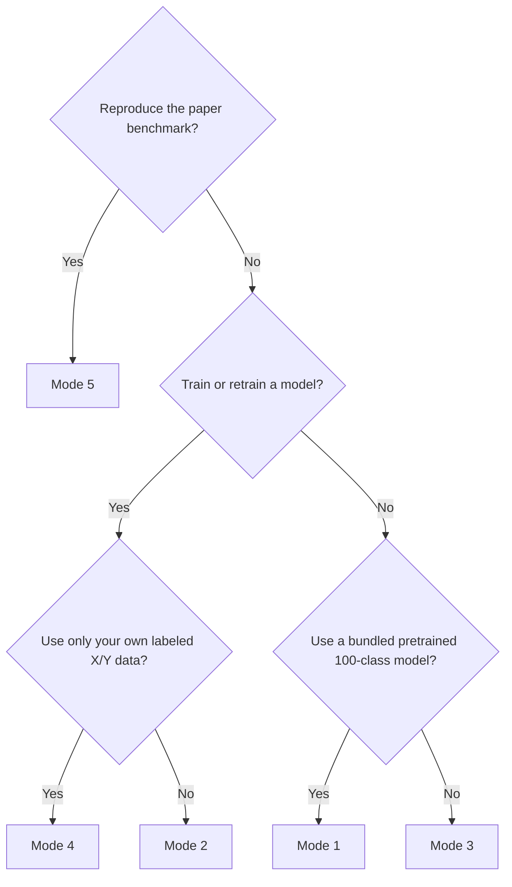

# DAP Breed Prediction

Code, models, and processed data for dog breed prediction and ancestry decomposition from the paper **"An interpretable machine learning framework for dog breed inference and ancestry decomposition."**

## Start With The Tutorial

**First-time users should open the [executed Jupyter tutorial](notebooks/tutorial_all_modes.ipynb).** It demonstrates installation, CSV and Parquet inspection, Python API calls, CLI commands, all five modes, and output inspection. Saved Mode 1 and Mode 2 logs and predictions can be viewed directly on GitHub without running the notebook.

The package supports both interfaces:

```python
from dap_breed_prediction import run_mode

run_mode(1, "configs/config_mode_1_template.yml")
```

```bash
python main.py -mode 1 -config_path configs/config_mode_1_template.yml
```

## Repository Layout

```text
DAP_breed_prediction/
├── main.py
├── pyproject.toml
├── requirements.txt
├── configs/                             # YAML templates for Modes 1-5
├── Figure_data/                         # Inputs for the executed figure notebook
├── data/
│   ├── Toy_X_full_54143_single.csv      # One full-length Mode 1 sample
│   ├── Toy_X_single.csv                 # One 266-SNP Mode 2/3 sample
│   ├── Toy_X_snps.csv                   # Labeled Mode 4 toy genotypes
│   ├── Toy_Y_labels.csv
│   ├── Toy_a_short_breed_list.txt
│   ├── paper_14_breed_list.txt
│   ├── X_train_SNP_WG_prune_v3_1_std_pca_100.csv
│   ├── X_test_SNP_WG_prune_v3_1_std_pca_100.csv
│   ├── y_combined_100.csv
│   └── folder_of_54143_SNPs/            # 38 processed DAP genotype Parquets
├── model/
│   ├── alternative_models/              # Optional pretrained PCA100 predictors
│   ├── model_registry.json              # Model names, thresholds, metrics, paths
│   ├── pca_model_WG_100.joblib
│   ├── regressor_model0_4-PCA100.pkl
│   └── README.md
├── notebooks/
│   ├── tutorial_all_modes.ipynb
│   └── reproduce_selected_paper_figures.ipynb
├── scripts/
│   └── train_pretrained_models.py       # Training code for Mode 1 model set
└── src/dap_breed_prediction/
    ├── api.py
    ├── cli.py
    ├── pipeline.py
    ├── helpers.py
    └── analysis.py
```

## Installation

Python 3.9 or newer is required.

```bash
git clone https://github.com/AkeyLab/DAP_breed_prediction.git
cd DAP_breed_prediction

python3 -m venv .venv
source .venv/bin/activate
python -m pip install --upgrade pip
python -m pip install -e .
```

Install Jupyter for the tutorial:

```bash
python -m pip install -e ".[tutorial]"
python -m jupyter lab notebooks/tutorial_all_modes.ipynb
```

Install optional backends for XGBoost, MLP, or Transformer Mode 1 inference:

```bash
python -m pip install -e ".[alternative-models]"
```

The same optional extra is needed to retrain the full alternative model set.

Use `python -m pip install -r requirements.txt` instead if an editable package installation is not wanted.

No GPU or other non-standard hardware is required. Modes 1, 3, and the toy Mode 4 example normally finish in under one minute. DAP-backed Mode 2 and paper-reproduction Mode 5 take longer and depend on available CPU and memory.

## Modes At A Glance

| Mode | Purpose | Uses DAP reference data? |
|:---:|---|:---:|
| 1 | Single-sample prediction with the bundled 100-output PCA model and a selected pretrained predictor | No\* |
| 2 | Retrain on all eligible DAP reference dogs, then predict supplied sample(s) | Yes |
| 3 | Test a saved model on multiple new samples, with optional labels and metrics | No |
| 4 | Train and evaluate a new model using only user-provided genotypes and labels | No |
| 5 | Reproduce the fixed 100-class paper benchmark | Uses bundled fixed PC matrices |

\*The bundled PCA and prediction models used by Mode 1 were developed from DAP data and are ready for inference. "No" means Mode 1 does not read additional DAP reference data or retrain the models when it runs.

The CLI mode is always explicit; configuration contents never change which mode is selected.
Each mode can also be called from Python with `run_mode()`. All workflow
parameters accepted by `run_mode()` can be supplied in a YAML file or a config
mapping; explicit keyword arguments are optional overrides and take precedence
over matching config keys. Each call returns its configured result directory as
a `pathlib.Path`; `base_dir` controls relative path resolution and defaults to
the current working directory.

## Command Generator

The repository includes a small command generator, similar in spirit to the selector on the PyTorch install page: choose the mode and options, and it writes the YAML file plus the command to run it.

Mode introductions:
[Mode 1](#mode-1-pretrained-single-sample-prediction) |
[Mode 2](#mode-2-dap-backed-retraining-and-prediction) |
[Mode 3](#mode-3-saved-model-prediction-or-performance-analysis) |
[Mode 4](#mode-4-train-on-user-data-only) |
[Mode 5](#mode-5-reproduce-the-paper-benchmark)



For a browser-based decision tree, open the
[rendered command generator](https://htmlpreview.github.io/?https://github.com/AkeyLab/DAP_breed_prediction/blob/main/docs/command_generator.html).
It asks whether you want to reproduce the paper benchmark, train a model, run a
bundled pretrained model, or run a saved model, then generates the YAML and
command.

For a cleaner project URL, enable GitHub Pages manually in the repository:
`Settings` -> `Pages` -> `Build and deployment` -> `Source: Deploy from a
branch` -> `Branch: main` -> `/docs`. After that, the webpage is available at
`https://akeylab.github.io/DAP_breed_prediction/`. You can also open
`docs/command_generator.html` locally in a browser.

For the same decision tree in a terminal, run:

```bash
python scripts/generate_run_command.py --interactive --force
```

You can also provide choices directly as flags:

```bash
python scripts/generate_run_command.py \
  --mode 4 \
  --config-path configs/generated_mode_4_xgboost.yml \
  --training-model-name xgboost \
  --xgboost-device cuda \
  --result-folder-path ./results/mode_4_xgboost \
  --force
```

It prints:

```text
Wrote YAML config: configs/generated_mode_4_xgboost.yml
Run this command:
python main.py -mode 4 -config_path configs/generated_mode_4_xgboost.yml
```

After package installation, the same generator is available as:

```bash
dap-breed-generate-command --mode 1 --pretrained-model-name ridge --force
```

All mode-specific config options are exposed as flags. For example, use `--breed-list-text-path ""` to clear a default breed-list path and train all available classes.

## Mode 1: Pretrained Single-Sample Prediction

**Designed for:** Predicting one dog's ancestry across the complete 100-output panel without retraining.

Mode 1 loads the bundled paper PCA plus one selected pretrained 100-output predictor.
The default predictor is Random Forest:

- `model/pca_model_WG_100.joblib`
- `model/regressor_model0_4-PCA100.pkl`

Other bundled predictors are listed in `model/model_registry.json`: `xgboost`,
`ridge`, `knn`, `extratrees`, `mlp`, and `transformer`. Ridge, KNN, MLP, and
Transformer also load their matching PC scaler before prediction. XGBoost,
MLP, and Transformer require the optional `alternative-models` dependencies.

The input must contain exactly one row, a `dog_id` column, and the complete 54,143-SNP feature set expected by the PCA. Columns may arrive in a different order because the package validates and reorders them by name. Missing or additional SNPs are rejected. Values must already use the training-only chromosome-wise standardization used for the paper model; raw `0/1/2` genotype calls are not valid because the original fitted SNP scalers were not retained.

The bundled `data/Toy_X_full_54143_single.csv` is a compatible one-row example. It is dog `109622` from the DAP training partition and is provided as an interface test, not as independent validation data.

Run from the CLI:

```bash
python main.py -mode 1 -config_path configs/config_mode_1_template.yml
```

Run from Python:

```python
from pathlib import Path

from dap_breed_prediction import run_mode


mode_1_config = {
    "result_folder_path": "./results/mode_1",
    "SNP_csv_path": "./data/Toy_X_full_54143_single.csv",
    "pretrained_model_name": "random_forest",
}

mode_1_results = run_mode(1, mode_1_config, base_dir=Path.cwd())
```

Required config keys: `result_folder_path`, `SNP_csv_path`.

Optional config keys:

- `pretrained_model_name`: registry model key, default `random_forest`.
- `pure_threshold`: override the selected model's registry threshold.
- `model_path` or `prediction_model_path`, `prediction_model_type`, and `scaler_path`: use a custom PCA100 predictor instead of a registry model.
- `pca_model_path`: override the bundled PCA model.
- `configure_logging`: set to `false` to suppress `process.log` creation and console logging.

Switching to another bundled predictor only changes `pretrained_model_name`.
For example, use `"xgboost"` after installing `.[alternative-models]`.

You can also select a custom PCA100 predictor directly by path:

```python
run_mode(
    1,
    {
        "result_folder_path": "./results/mode_1_custom",
        "SNP_csv_path": "./data/Toy_X_full_54143_single.csv",
    },
    base_dir=Path.cwd(),
    model_path="./model/alternative_models/ridge-PCA100.joblib",
    scaler_path="./model/alternative_models/ridge_scaler-PCA100.joblib",
    prediction_model_type="sklearn",
    pure_threshold=0.87,
)
```

The default example predicts `Australian Shepherd` with a maximum raw score of `0.965`.

## Mode 2: DAP-Backed Retraining And Prediction

**Designed for:** Retraining a model against DAP when the new assay has only a subset of the paper SNPs and, optionally, only selected output classes are relevant.

Mode 2 performs the following operations:

1. Loads the complete bundled DAP reference label table and all 38 standardized chromosome Parquets.
2. Combines all eligible labeled DAP samples rather than preserving the paper train/test split.
3. Finds the ordered overlap `X'` between SNP columns in the supplied `SNP_csv_path` and the 54,143 DAP SNPs.
4. Uses all 100 output classes unless `breed_list_text_path` supplies a subset of classes, one per line.
5. Trains the selected prediction model, plus a scaler and PCA when the feature-to-sample ratio triggers PCA, and selects the purity threshold from the training predictions.
6. Saves every fitted artifact, the exact SNP/class schema, and the purity threshold.
7. Predicts the supplied sample row or rows with the newly trained model.

The process log prints the full DAP dimensions, selected sample and class counts, selected class names, requested SNP count, and overlap size. The bundled DAP label table contains 6,572 labeled dogs and 100 outputs; the original metadata filtering stage retained 7,618 dogs before label availability and downstream filtering.

Run from the CLI:

```bash
python main.py -mode 2 -config_path configs/config_mode_2_template.yml
```

Run from Python:

```python
from pathlib import Path

from dap_breed_prediction import run_mode


mode_2_config = {
    "result_folder_path": "./results/mode_2",
    "SNP_csv_path": "./data/Toy_X_single.csv",
    "breed_list_text_path": "./data/paper_14_breed_list.txt",  # Optional
    "include_unknown": False,
    "training_model_name": "random_forest",
    "random_state": 42,
}

mode_2_results = run_mode(2, mode_2_config, base_dir=Path.cwd())
```

Required config keys: `result_folder_path`, `SNP_csv_path`.

Optional config keys: `breed_list_text_path`, `include_unknown` (default `true`), `training_model_name` (default `random_forest`; options: `random_forest`, `xgboost`, `ridge`, `knn`, `extratrees`, `mlp`, `transformer`), `xgboost_device` (`auto`, `cpu`, or `cuda`; used only when `training_model_name` is `xgboost`), `pca_components` (default `0.95`), `random_state` (default `42`), `configure_logging` (default `true`). Mode 2 always learns its purity threshold during training; a configured `pure_threshold` is ignored.

`ridge`, `knn`, `mlp`, and `transformer` fit an additional model-input scaler after any PCA step. XGBoost and PyTorch-based models require `python -m pip install -e ".[alternative-models]"`.

The bundled 14-class example selects `0.62` in the reference environment. Other SNP or class panels may select a different value; use the threshold and matching model filename recorded in `Model/model_metadata.json` when configuring Mode 3.

The template uses `data/Toy_X_single.csv`, which is one row copied from `data/Toy_X_snps.csv` and contains 266 SNPs. It also uses the following 14 outputs from the paper section **"Leveraging SNP importance scores to create small panels of informative variants"**:

```text
Australian Shepherd                 Beagle
Bernese Mountain Dog                Border Collie
Boston Terrier                      Cavalier King Charles Spaniel
Dachshund                           French Bulldog
German Shepherd Dog                 Golden Retriever
Great Dane                          Labrador Retriever
Pembroke Welsh Corgi                Poodle
```

Remove `breed_list_text_path` from the YAML to retrain all 100 outputs. The toy dog is part of DAP, so this run demonstrates the workflow but is not an independent performance estimate.

## Mode 3: Saved-Model Prediction Or Performance Analysis

**Designed for:** Multi-sample prediction with a model produced by Mode 2 or Mode 4, or performance analysis when labels are also available.

Mode 3 does not train a model and does not load DAP reference genotypes. Supply the model path, its purity threshold, its `model_metadata.json` sidecar, and a new genotype CSV. The genotype columns must match the exact SNP set recorded in the metadata; columns are reordered safely when names match, while missing or extra SNPs produce an error. The metadata also locates any saved scaler, PCA, and model-input scaler.

When `label_path` is omitted, Mode 3 writes predictions only. When labels are provided, it also calculates strict and loose accuracy and writes per-sample, per-section, and per-class results plus a confusion map.

Run from the CLI after creating the template Mode 2 model:

```bash
python main.py -mode 2 -config_path configs/config_mode_2_template.yml
python main.py -mode 3 -config_path configs/config_mode_3_template.yml
```

Run from Python:

```python
from pathlib import Path

from dap_breed_prediction import run_mode


repo_root = Path.cwd()
run_mode(2, "configs/config_mode_2_template.yml", base_dir=repo_root)

mode_3_config = {
    "result_folder_path": "./results/mode_3",
    "SNP_csv_path": "./data/Toy_X_single.csv",
    "prediction_model_path": "./results/mode_2/Model/Prediction_model_theta_0.62.pkl",
    "model_metadata_path": "./results/mode_2/Model/model_metadata.json",
    "pure_threshold": 0.62,
    "label_path": "./data/Toy_Y_labels.csv",
}

mode_3_results = run_mode(3, mode_3_config, base_dir=repo_root)
```

Required config keys: `result_folder_path`, `SNP_csv_path`, `prediction_model_path` or `model_path`, `pure_threshold`.

Optional config keys: `model_metadata_path` (automatically sought beside the model), `scaler_path`, `pca_model_path`, `model_input_scaler_path`, `prediction_model_type`, `label_path`, `configure_logging`.

The label CSV must contain `dog_id` and `label`. Use `BreedName` for a pure dog and `BreedA / BreedB` for a two-breed mix.

## Mode 4: Train On User Data Only

**Designed for:** Training and evaluating the framework on a user-owned labeled dataset with no DAP data involved.

Mode 4 reads the supplied X and Y files, creates a train/test split, optionally standardizes and applies PCA, trains the selected prediction model, selects a purity threshold on the training split, and evaluates the held-out split. It saves the fitted model, optional raw-feature scaler/PCA, optional model-input scaler, and `model_metadata.json`, so the resulting model can be used directly by Mode 3.

Run from the CLI:

```bash
python main.py -mode 4 -config_path configs/config_mode_4_template.yml
```

Run from Python:

```python
from pathlib import Path

from dap_breed_prediction import run_mode


mode_4_config = {
    "result_folder_path": "./results/mode_4",
    "SNP_csv_path": "./data/Toy_X_snps.csv",
    "label_path": "./data/Toy_Y_labels.csv",
    "breed_list_text_path": "./data/Toy_a_short_breed_list.txt",
    "training_model_name": "random_forest",
    "pca_components": 0.95,
    "random_state": 42,
    "test_size": 0.3,
}

mode_4_results = run_mode(4, mode_4_config, base_dir=Path.cwd())
```

Required config keys: `result_folder_path`, `SNP_csv_path`, `label_path`.

Optional config keys: `breed_list_text_path`, `training_model_name` (default `random_forest`; options: `random_forest`, `xgboost`, `ridge`, `knn`, `extratrees`, `mlp`, `transformer`), `xgboost_device` (`auto`, `cpu`, or `cuda`), `pca_components` (default `0.95` when PCA is triggered), `random_state` (default `42`), `test_size` (default `0.3`), `configure_logging` (default `true`).

`ridge`, `knn`, `mlp`, and `transformer` fit an additional model-input scaler after any PCA step. XGBoost and PyTorch-based models require `python -m pip install -e ".[alternative-models]"`.

## Mode 5: Reproduce The Paper Benchmark

**Designed for:** Reproducing the fixed 100-class paper training and test experiment, not analyzing new samples.

Mode 5 trains a new 100-output random forest with random seed `42` from the bundled 100-PC training matrix, chooses the pure-versus-mixed threshold on the training set, and evaluates the fixed test matrix. It does not load the pretrained Mode 1 random forest and does not read the 38 chromosome Parquets.

Run from the CLI:

```bash
python main.py -mode 5 -config_path configs/config_mode_5_template.yml
```

Run from Python:

```python
from pathlib import Path

from dap_breed_prediction import run_mode


mode_5_config = {
    "result_folder_path": "./results/mode_5",
}

mode_5_results = run_mode(5, mode_5_config, base_dir=Path.cwd())
```

Required config keys: `result_folder_path`.

Optional config keys: `random_state` (default `42`), `pca_components` (fixed at `100` in the template), `test_size` (fixed at `0.3` in the template), `configure_logging` (default `true`). Keep the template defaults to reproduce the reported benchmark.

The current reference run reports:

```text
Wall-clock time: 256.43 seconds (4 minutes 16 seconds)
Best purity threshold (theta) is 0.7.
Strict Accuracy: 58.67%
Loose Accuracy: 91.71%
Number of Wrong Samples - Strict: 818, Loose: 164
```

Small numerical differences may occur across dependency versions and platforms. Strict accuracy requires the full pure/mixed assignment to match; loose accuracy requires at least one predicted breed to overlap the label.

Mode 5 uses:

- `data/X_train_SNP_WG_prune_v3_1_std_pca_100.csv`
- `data/X_test_SNP_WG_prune_v3_1_std_pca_100.csv`
- `data/y_combined_100.csv`

Training is CPU-only. The wall-clock time above measures only the Mode 5 command after dependencies were installed.

### Alternative Model Comparison

The comparison below uses the same 70/30 split-specific PCA100 representation
and the same purity-threshold post-processing as Mode 5. Timings were recorded
on an Intel(R) Xeon(R) Platinum 8380 CPU node with 80 logical CPUs and one
NVIDIA A100-PCIE-40GB GPU. Train is model-fitting time; infer combines
train-set prediction for threshold selection and held-out test-set prediction.
In the paper, we discuss the CPU best model, **Random Forest**, because CPU-only
execution is broadly accessible for researchers with limited computing
resources. **XGBoost** is the best GPU-backed model in this comparison and can
be analyzed in a very similar way.

| Model | Threshold (theta) | Strict | Loose | Hardware | Train | Infer | Total |
|---|---:|---:|---:|---|---:|---:|---:|
| MLP | 0.97 | 36.08% | 93.23% | GPU, A100 | 21.93s | 0.60s | 22.53s |
| ExtraTrees | 0.99 | 35.07% | 93.03% | CPU | 6.16s | 0.31s | 6.47s |
| **XGBoost** | 0.69 | 59.32% | 92.77% | GPU, A100 | 16.32s | 0.85s | 17.17s |
| Ridge | 0.87 | 48.51% | 92.02% | CPU | 0.32s | 0.10s | 0.43s |
| KNN | 0.99 | 39.36% | 91.76% | CPU | 0.01s | 6.53s | 6.54s |
| **Random Forest** | 0.70 | 58.67% | 91.71% | CPU | 273.02s | 2.36s | 275.38s |
| Transformer | 0.97 | 47.15% | 90.60% | GPU, A100 | 18.00s | 0.61s | 18.60s |

The XGBoost result should be interpreted as a GPU-backed result. A
same-parameter CPU-only XGBoost run was attempted earlier and terminated after
more than 30 minutes without completing. This is the main practical tradeoff:
XGBoost gives the best strict and loose accuracy in this comparison, but the
measured run uses GPU acceleration, while the Random Forest benchmark remains
CPU-only and therefore easier to reproduce in CPU-limited research settings.

The training code for these models is in
`scripts/train_pretrained_models.py`. It records the exact estimator
configuration for each model, trains on
`data/X_train_SNP_WG_prune_v3_1_std_pca_100.csv`, selects theta from training
predictions, evaluates on `data/X_test_SNP_WG_prune_v3_1_std_pca_100.csv`, and
writes model artifacts plus `training_summary.csv`.

```bash
python -m pip install -e ".[alternative-models]"
python scripts/train_pretrained_models.py --output-dir results/pretrained_model_training
```

To train only CPU-accessible sklearn models:

```bash
python scripts/train_pretrained_models.py \
  --models random_forest,ridge,knn,extratrees \
  --output-dir results/pretrained_model_training_cpu
```

## Configuration Templates

- `configs/config_mode_1_template.yml`
- `configs/config_mode_2_template.yml`
- `configs/config_mode_3_template.yml`
- `configs/config_mode_4_template.yml`
- `configs/config_mode_5_template.yml`

Relative paths in a YAML file are resolved from the current working directory. Run commands from the repository root unless absolute paths are used.

## Reproduce The Paper Figures

The [executed figure notebook](notebooks/reproduce_selected_paper_figures.ipynb) contains the calculations and saved outputs for Fig. 2b, Fig. 2c, Fig. 2e, Fig. 3b, Fig. 3c, Fig. 3d, Fig. 3e, Fig. 3f, and Fig. 3h. It uses the archived 10-class small model for Fig. 2c and does not retrain that model. Required inputs are under `Figure_data/` or elsewhere in the repository.

```bash
python -m pip install -e ".[figures]"
python -m jupyter lab notebooks/reproduce_selected_paper_figures.ipynb
```

GitHub displays all saved notebook outputs. Set `DAP_FIGURE_DATA` only when overriding the default `Figure_data/` directory.

## Output Files

Every mode writes `process.log`, `Table/`, `Model/`, and `Figure/` under `result_folder_path`.

Common prediction tables:

- `Table/Raw_prediction.csv`: one score per model output
- `Table/Transformed_prediction.csv`: thresholded pure or two-breed assignments
- `Table/Predictions.csv`: readable breed labels

Mode 2 additionally writes:

- `Model/Prediction_model_theta_<value>.pkl`
- `Model/model_metadata.json`
- `Model/scaler.joblib` and `Model/pca.joblib` when PCA is used
- `Table/Overlapping_SNPs.txt`
- `Table/Selected_classes.txt`
- SNP-importance tables and figures

Mode 3 with labels and Mode 4 additionally write performance tables, including `Table/Performance_metrics.csv` with strict and loose accuracy.

Only load pickle or Joblib model files from trusted sources because deserialization can execute arbitrary code.

## Bundled DAP Reference Data

Only Mode 2 reads the processed chromosome-wise DAP reference matrices:

```text
data/folder_of_54143_SNPs/X_SNP_ch*_pruned_v3_std.parquet
```

All 38 autosomal Parquet files are included in the repository. A complete clone therefore contains the processed DAP inputs required by Mode 2. The original DAP VCF and metadata are not distributed.

## Preparing DAP Genotypes From VCF

This section documents how the chromosome-wise Parquet matrices were derived from the DAP 2023 genotype data. These steps are needed only to rebuild the processed reference inputs; the standard package workflows use the files already included in the repository.

Access to Dog Aging Project Curated Data must be requested through the [DAP Data Access page](https://dogagingproject.org/data-access/). Applicants must receive approval and sign an individual Data Use Agreement before accessing data through Terra. Availability of the specific DAP 2023 release files depends on the approved workspace.

The historical analysis started from a pre-generated PLINK binary dataset (`.bed`, `.bim`, and `.fam`). The exact command that created it was not retained. Step 1 is a reconstruction from the source filename and recorded filters, not a guaranteed byte-for-byte reconstruction. If the original PLINK files are available, skip Step 1 and set `BFILE` in Step 3 to their shared prefix.

### 1. Convert VCF To PLINK

Install [PLINK 1.9](https://www.cog-genomics.org/plink/1.9/) and run:

```bash
PLINK=/path/to/plink
VCF=/path/to/DogAgingProject_2023_N-7627_canfam4.vcf.gz
BFILE=/path/to/output/DogAgingProject_2023_N-7627_canfam4_gp-0.70_biallelic

"${PLINK}" \
  --vcf "${VCF}" \
  --dog \
  --vcf-min-gp 0.70 \
  --biallelic-only strict \
  --const-fid 0 \
  --make-bed \
  --out "${BFILE}"
```

This reconstructed command treats genotype calls with a maximum genotype probability below `0.70` as missing and retains strictly biallelic variants. Confirm these assumptions against the provenance of the source VCF before using the result for a new analysis.

### 2. Create The PLINK Sample List

The paper workflow retained samples with a DNA swab ID, excluded dog `27669`, and removed Village Dogs. The expected retained count at this metadata stage is 7,618.

```python
from pathlib import Path

import pandas as pd

metadata_path = Path("/path/to/DAP_2023_DogOverview_v1.0.csv")
keep_path = Path("/path/to/work/all_dog_ids.txt")

metadata = pd.read_csv(metadata_path)
metadata = metadata.loc[metadata["DNA_Swab_ID"].notna()].copy()
metadata = metadata.loc[metadata["dog_id"] != 27669]
metadata = metadata.loc[~metadata["Breed"].str.contains("Village", na=False)]

keep = metadata[["dog_id"]].copy()
keep.insert(0, "family_id", 0)
keep_path.parent.mkdir(parents=True, exist_ok=True)
keep.to_csv(keep_path, sep="\t", index=False, header=False)

print(f"Retained samples: {len(metadata):,}")
```

The tab-delimited output contains the family ID and individual ID columns expected by PLINK `--keep`.

### 3. Export Per-Chromosome Dosage CSV Files

The paper used the 38 dog autosomes and a minor allele frequency threshold of `0.4`. PLINK `--recode 12` writes each allele as `1` or `2`; the `awk` command sums each pair and subtracts two to produce dosages `0`, `1`, or `2`.

```bash
PLINK=/path/to/plink
BFILE=/path/to/output/DogAgingProject_2023_N-7627_canfam4_gp-0.70_biallelic
KEEP=/path/to/work/all_dog_ids.txt
WORK_DIR=/path/to/work/plink_export
CSV_DIR=/path/to/output/csv

mkdir -p "${WORK_DIR}" "${CSV_DIR}"

for CHR in $(seq 1 38); do
  PREFIX="${WORK_DIR}/classification_filt_ch${CHR}"

  "${PLINK}" \
    --bfile "${BFILE}" \
    --dog \
    --keep "${KEEP}" \
    --chr "${CHR}" \
    --recode 12 \
    --maf 0.4 \
    --out "${PREFIX}"

  awk '
    BEGIN { printf "dog_id" }
    NR == FNR { printf ",%s", $2; next }
    { printf "\n%d", $2; for (i = 7; i <= NF; i += 2) printf ",%d", $i + $(i + 1) - 2 }
    END { printf "\n" }
  ' "${PREFIX}.map" "${PREFIX}.ped" > "${CSV_DIR}/X_SNP_ch${CHR}.csv"
done
```

### 4. LD-Prune, Standardize, And Write Parquet

```bash
python -m pip install pandas polars pyarrow scikit-learn scikit-allel
```

The following reproduces the recorded per-chromosome processing: remove constant variants, apply Rogers-Huff LD pruning with a 500-variant window, 50-variant step, and `r^2` threshold `0.1`, standardize each retained SNP, and write Parquet.

```python
from pathlib import Path

import allel
import numpy as np
import pandas as pd
import polars as pl
from sklearn.preprocessing import StandardScaler

csv_dir = Path("/path/to/output/csv")
parquet_dir = Path("/path/to/output/parquet")
parquet_dir.mkdir(parents=True, exist_ok=True)


def locate_pruned_variants(genotypes: pd.DataFrame) -> np.ndarray:
    matrix = genotypes.to_numpy(dtype=np.float32).T
    variable = np.nanstd(matrix, axis=1) > 0
    variable_indices = np.flatnonzero(variable)
    unlinked = allel.locate_unlinked(
        matrix[variable].astype("float32"), size=500, step=50, threshold=0.1
    )
    return variable_indices[unlinked]


for chromosome in range(1, 39):
    source = csv_dir / f"X_SNP_ch{chromosome}.csv"
    genotypes = pl.read_csv(source).to_pandas().set_index("dog_id")
    genotypes = genotypes.iloc[:, locate_pruned_variants(genotypes)]
    genotypes.index = genotypes.index.astype(str)
    genotypes = genotypes.sort_index()

    scaled = pd.DataFrame(
        StandardScaler().fit_transform(genotypes),
        index=genotypes.index,
        columns=genotypes.columns,
    )
    destination = parquet_dir / f"X_SNP_ch{chromosome}_pruned_v3_std.parquet"
    scaled.to_parquet(destination)
    print(chromosome, genotypes.shape, destination)
```

This all-sample standardization matches the bundled Mode 2 reference Parquets. For a new held-out benchmark, split samples first, fit each `StandardScaler` on training samples only, and use that fitted scaler to transform test samples to prevent test information from entering preprocessing.
